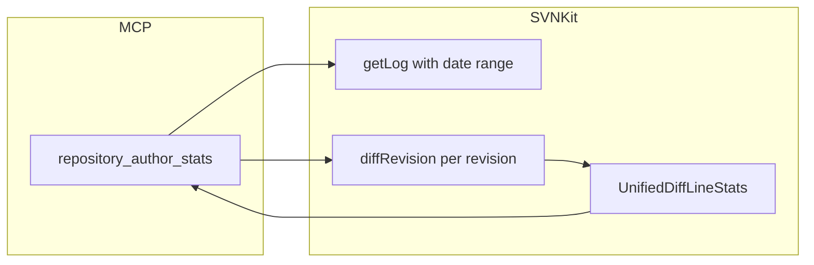

# 시나리오: 기간별 작성자 생산량 (diff 우선, 커밋 수 차순)

한 SVN 저장소에서 **특정 기간** 동안의 “생산량”을 사람별로 비교한다. 지표는 다음 순서로 본다.

1. **1순위:** 코드 변경량 — unified diff에서 집계한 **추가·삭제 라인**(합을 `diffMagnitude`로 표현).
2. **2순위:** 해당 기간의 **커밋 수**.

예: “오늘 하루(서울 기준) 동안 누가 얼마나 기여했는지”를 생산량 순으로 나열한다.

---

## 이 시나리오는 현재 MCP만으로 가능한가?

**가능하다.** 별도 SVNKit 신규 개발 없이, MCP 도구 **`repository_author_stats`** 하나로 위 기준에 맞는 집계·정렬이 이미 구현되어 있다.

- 기간은 **`calendar_date` + `timezone`**(로컬 달력 하루) 또는 **`start_inclusive` / `end_inclusive`**(ISO-8601 구간)로 지정한다.
- 응답의 **`byAuthor` 배열 순서**가 서버에서 정렬된 최종 순위다: `diffMagnitude` 내림차순 → 동률이면 `commitCount` 내림차순 → 작성자명.

---

## 사용 도구

| 도구 | 역할 |
|------|------|
| `repository_author_stats` | 기간 내 커밋 로그를 모은 뒤, 리비전마다 `svn diff -c`에 해당하는 변경을 계산하고 작성자별로 라인 수·커밋 수를 합산한다. |

다른 도구(`get_log` 등)는 **교차 검증**이나 상세 조회에만 쓰면 되고, “순위표” 자체는 이 도구만으로 충분하다.

---

## 에이전트 / 사용자 프롬프트 예시

에이전트가 아래와 같은 요청을 받으면, `repository_id`와 날짜·타임존을 채워 `repository_author_stats`를 호출하면 된다.

- `설정에 있는 test-repo 저장소에서, 오늘(한국 시간 기준) 하루 동안 작성자별 생산량을 diff 많은 순으로 보여줘.`
- `이번 주 월요일~금요지 Asia/Seoul 기준으로 trunk 아래만 집계해서 사람별 커밋 수와 변경 라인 순위를 줘.`
- `2026-04-01부터 2026-04-30까지 저장소 전체 작성자 활동량을 생산량 기준으로 정렬해줘.` (이 경우 `start_inclusive` / `end_inclusive` 사용)

**주요 인자 요약**

| 인자 | 설명 |
|------|------|
| `repository_id` | `application.yml`에 정의된 저장소 ID (필수). |
| `path_prefix` | 비우면 저장소 루트 전체; `trunk/` 등으로 범위 제한 가능. |
| `calendar_date` | 로컬 달력 **하루** (예: `2026-04-03`). `timezone`과 함께 쓴다 (기본 `UTC`). |
| `timezone` | IANA ID (예: `Asia/Seoul`). |
| `start_inclusive` / `end_inclusive` | `calendar_date` 대신 쓸 수 있는 ISO-8601 순간 구간(둘 다 필요). |
| `max_revisions_to_analyze` | diff 통계에 쓸 리비전 수 상한(서버 기본 `max_revisions_for_stats` 이하로 캡). |

---

## 응답 필드 읽는 법

`repository_author_stats` 결과 JSON에서 다음을 보면 된다.

| 필드 | 의미 |
|------|------|
| `byAuthor` | **정렬된** 작성자별 행 배열. 앞쪽일수록 생산량 순위가 높다. |
| `byAuthor[].author` | SVN 로그의 작성자. |
| `byAuthor[].linesAdded` / `linesRemoved` | 해당 기간·분석 대상 리비전에서 합산한 추가/삭제 라인. |
| `byAuthor[].diffMagnitude` | `linesAdded + linesRemoved` (1순위 정렬 기준). |
| `byAuthor[].commitCount` | 해당 작성자의 커밋 수 (2순위 정렬 기준). |
| `byAuthor[].revisions` | 분석에 포함된 리비전 번호 목록(내림차순 정렬). |
| `rankings.largest_diff` | `diffMagnitude` 기준 1위 작성자(요약). |
| `rankings.most_commits` | 커밋 수만 보면 최다인 작성자(요약; 순위표 순서와 다를 수 있음). |
| `revisionCountInRange` | 날짜 필터를 통과한 로그 엔트리 수(대략 기간 내 커밋 수 상한). |
| `revisionsAnalyzed` | 실제로 diff 통계를 계산한 리비전 개수. |
| `truncated` | 분석 상한에 걸려 **일부 리비전만** 통계에 넣었을 때 `true`. 이때 순위는 “분석된 리비전 기준”이다. |
| `logStartRevision` / `logEndRevision` | 날짜로부터 잡은 리비전 범위(근사). 엄밀한 시각 경계는 로그의 커밋 시각 필터로 맞춘다. |

---

## 한계와 운영

서버 기본값은 `src/main/resources/application.yml`의 `io.github.jason07289.svn.mcp.defaults`를 따른다.

| 설정 / 동작 | 기본값(예) | 영향 |
|-------------|------------|------|
| `log_limit_max` | 500 | `get_log`가 한 번에 가져오는 로그 엔트리 상한. **하루 커밋이 이보다 많으면** 일부 커밋이 로그 단계에서 빠질 수 있다. |
| `max_revisions_for_stats` | 500 | 통계에 쓸 리비전 수 상한. 초과 시 `truncated: true`. |
| `max_revisions_to_analyze` (도구 인자) | 생략 시 위 기본값 | 필요 시 호출마다 낮추거나(부하 감소), 상한은 설정으로 올린 뒤 사용. |
| 비용 | 리비전당 약 1회 `diffRevision` | 커밋이 매우 많은 날은 응답 시간·서버 부하가 커진다. |

**권장:** 활발한 저장소에서는 `log_limit_max`와 `max_revisions_for_stats`를 조직 규모에 맞게 올리고, `truncated`가 `true`면 기간을 쪼개서 재조회하거나 한도를 조정한다.

---

## 데이터 흐름 (요약)

---

## 관련 코드

- MCP 도구: `SvnMcpTools.repositoryAuthorStats`
- 구현: `SvnKitRepositoryOperations.repositoryAuthorStats`
- 결과 타입: `RepositoryAuthorStatsResult`, `AuthorActivityRow`
